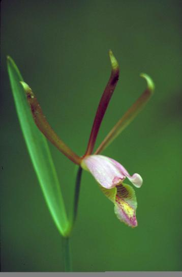

Photo by <a href="https://pixnio.com/flora-plants/flowers/orchid-flower-pictures/spreding-pogonia-or-rosebud-orchid-cleistes-divaricata-plant-with-pink-and-yellow-blossom">Barnes Dr Thomas G, USFWS</a> on <a href="https://pixnio.com/">Pixnio</a>
# ¡Tachán! Comenzamos blog
Me estoy acostumbrando a esto de Markdown, paciencia, por favor

### Una tiene ya una edad y los cambios cada vez cuestan más, pero cualquiera lo diría 😉

He decidido cambiarme a esto de Markdown y dejar mi intento de julio en un aparte porque, sinceramente, me faltaba diseñar una estructura. Eso lleva tiempo 
y hay muchas cosas que aprender y hacer en la vida... Y una quiere hacer demasiadas. 

La idea era demostrar que sé manejar muchas herramientas y que el inglés lo tengo controlado. Dominado, quizá no, siempre falta pulir, pero bastante controlado.
Aunque la idea acabará llevándose a cabo, es algo ambicioso y hay que ir poco a poco. Volvamos a los básicos, porque si no, ni una cosa ni la otra ni ninguna. Ya sabéis 
el dicho de abarcar y apretar, ¿no?

Necesito también un lugar donde poder dejar las cosas que necesito y tenerlas a mano. Mis pocos o muchos scripts, cosillas que me venga bien poner aquí para repasar. 
Y mientras, aprendo Markdown. Un _win-win_, así que vamos a ello.
